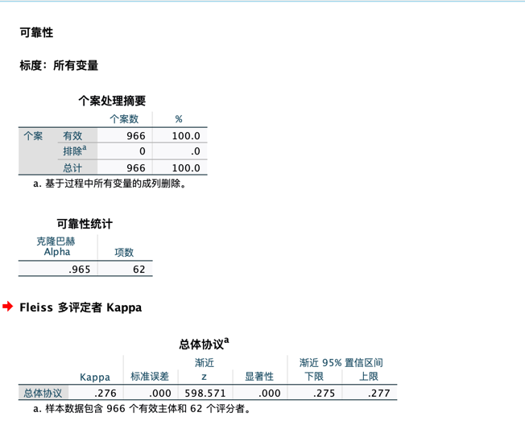
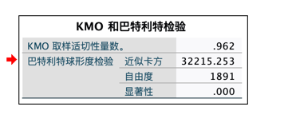

# 身体活动对大学生积极心理品质的研究影响
#---------------------------------------------------------

## 一、数据清洗
>清洗条件
>1. 以序号作为学生的唯一编号
>2. 删除无关维度：填写时间、IP地址等
>3. 删除错误填写年龄的样本
>4. 计算积极心理品质的总得分及各项维度得分
>5. 读取体育量表填写结果，与原表进行合并
>6. 根据IPAQ的规则，进行异常数据剔除和数据截断处理，再计算MET值以及判断身体活动强度分级

最后得到有效样本共计966份
>特征维度：
>> '序号', '年龄', '年级', '专业', '性别', '家庭所在地', '家庭经济情况', '学习成绩', '对待体育活动的态度',
        '认知', '人际', '情感', '公正', '节制', '超越', '积极心理品质得分', '剧烈运动天数', '剧烈运动单日分钟数',
        '每周剧烈MET', '适度运动天数', '适度运动单日分钟数', '每周适度MET', '步行天数', '步行单日分钟数',
        '每周步行MET', '总MET', '总天数', '运动强度\n1轻2中3强', '工作日久坐分钟数', 'IPAQ_8'
## 二、数据分析
###（1）信效度检验
>信度检验：克朗巴赫系数 cronbacha α系数
> >信度分析的作用是检验结果的一致性或稳定性，信度大小的衡量标准是信度系数，信度系数越大，说明越可信，信度系数在0.8以上为信度最好，0.7~0.8为可接受的范围。

结果显示，心理积极品质问卷的cronbacha α系数： 0.9651820315493126 属于高信度
> 
> 效度检验：KMO 和Bartlett 检验
> >效度分析的作用是，检验被调查者是否理解了问卷设计者的意图，也就是问卷是否有效达到了调查的目的。本节使用SPSS中的KMO 和Bartlett 检验对文问卷的数据进行分析。KMO统计量是为了检验变量间的偏相关性。K MO值越接近于1，说明变量间相关性越大。Barlett 球体检验用于检验相关阵是否为单位阵。检验统计量服从χ2分布，如果检验结果不拒绝原假设(即P>0.05)，不适合做因子分析。因此，当KMO 检验系数＞0.5，Bartlett 球体检验的χ2 统计值的显著性概率P 值<0.05时，问卷才有结构效度。
>>KMO值为0.747大于0.5，表明问卷数据适合进行因子分析；Bartlett检验结果P值<0.05，认为该次问卷有效。
>

###（2）自变量分析
>本研究的暴露/处理因素因素。但是其余变量，例如年龄这些，也是可能影响因变量的因素，需要都做一次分析。
> 分别做单因素和多因素分析，通过单因素初步得到有影响的因素，再通过多因素分析进一步判断是否真实有效。

>我直接做了逐步回归分析，得出的相关系数中，身体活动强度的系数为负数，说明异常，经分析，可能是数据存在异常值。
>>尝试盖帽法，将均值+-3倍标准差的范围作为正常值，异常值替换为边界值。

## 三、聚类分析

## 四、回归分析（神经网络）

